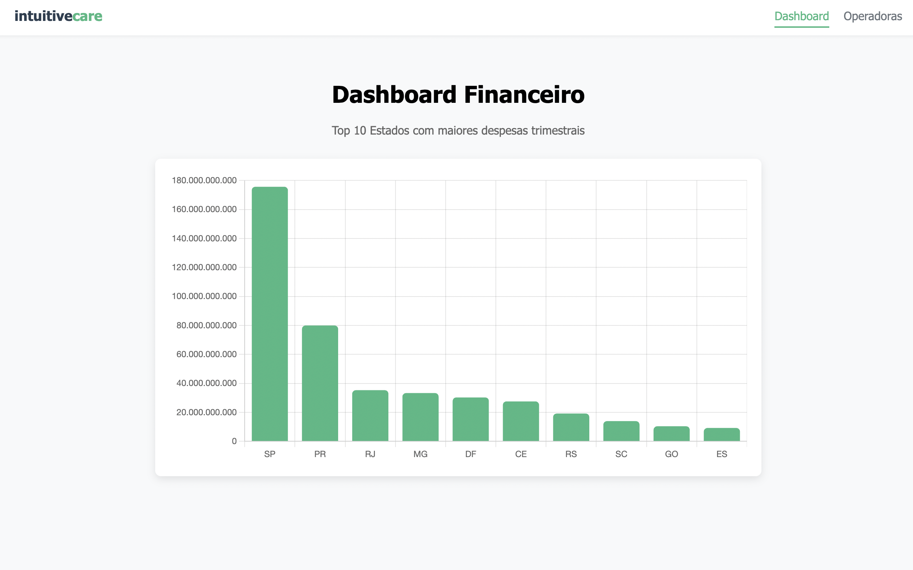
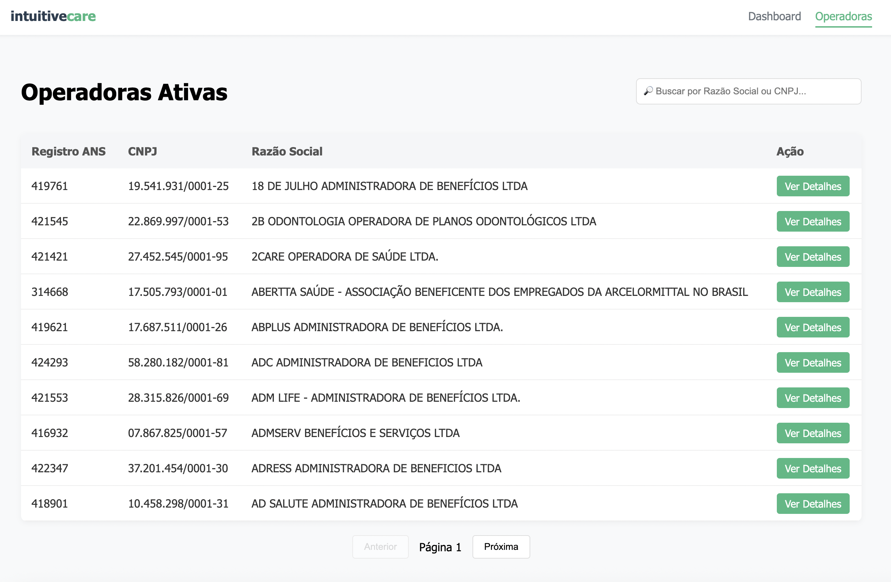
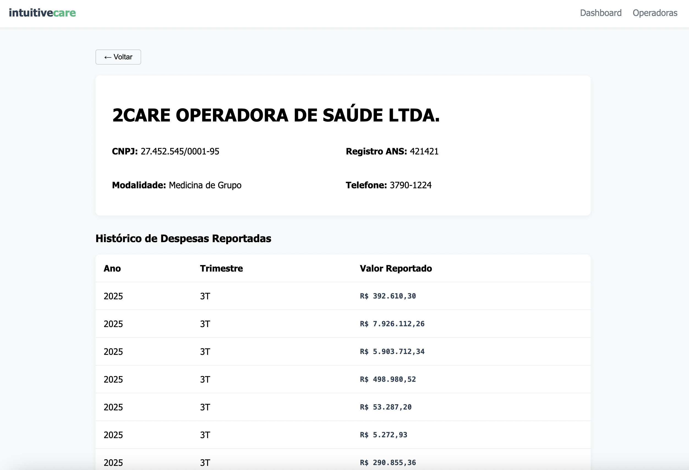

> **⚠️ DISCLAIMER: NOTA SOBRE A ORIGEM DOS DADOS**
>
> Os arquivos originais `.csv` de `Demontracoes_contabeis` da ANS não contêm nativamente os campos: **CNPJ**, **RazaoSocial** e **ValorDespesas**.
> Para atender aos requisitos do teste mantendo a integridade dos dados, adotei a seguinte estratégia de engenharia de dados:
>
> * **CNPJ:** Enriquecido via cruzamento (*JOIN*) entre o arquivo de cadastro (`operadoras_de_plano_de_saude_ativas`) e as demonstrações, utilizando a chave primária `REG_ANS` (Cadastro) x `REGISTRO_OPERADORA` (Contábil).
> * **Razão Social:** Recuperada do arquivo de cadastro (`operadoras_de_plano_de_saude_ativas`) através do mesmo cruzamento.
> * **Trimestre:** Calculado via lógica de extração temporal a partir da coluna `DATA` do arquivo `Demontracoes_contabeis`.
> * **Ano:** Extraído da mesma coluna `DATA` do arquivo `Demontracoes_contabeis`.
> * **Valor Despesas:** Mapeado diretamente a partir da coluna `VL_SALDO_FINAL` das demonstrações contábeis.

# 🏥 Intuitive Care - Teste Técnico (Full Stack)

Este repositório contém a solução completa para o desafio técnico de estágio da Intuitive Care. O projeto consiste em uma aplicação Full Stack para análise de dados da ANS (Agência Nacional de Saúde Suplementar), cobrindo desde a extração de dados (ETL) até a visualização em um Dashboard interativo.

 


---

## 🚀 Tecnologias Utilizadas

A arquitetura foi pensada para ser modular, escalável e de fácil manutenção, respeitando o princípio *Keep It Simple, Stupid*.

* **ETL & Processamento:** Java 17 (Manipulação robusta de arquivos CSV).
* **Banco de Dados:** PostgreSQL 14 (Executando via Docker).
* **Backend:** Python (Flask) - API REST leve e eficiente.
* **Frontend:** Vue.js 3 + Vite + Pinia - Interface reativa e moderna.
* **Infraestrutura:** Docker & Docker Compose.

---

## 📂 Estrutura do Projeto

```text
teste-intuitive-care/ 
├── AUX_CSV/ # Arquivos brutos baixados da ANS 
├── TEMP/ # Arquivos CSV processados/limpos pelo Java 
├── src/main/java/ # Código Fonte Java (ETL) 
├── backend/ # API Python (Flask) 
├── frontend/ # Interface Vue.js 
├── sql/ddl.sql # Scripts SQL (DDL para criacao das tabelas) 
└── docker-compose.yml # Orquestração do Banco de Dados
└── import.sql # (script de importacao para o BD das tabelas)
└── docker-compose.yml # Orquestração do Banco de Dados
```

---

## 🛠️ Como Executar o Projeto (Passo a Passo)

### 1. Banco de Dados (Docker)
Certifique-se de ter o Docker instalado. Na raiz do projeto:
```bash
docker-compose up -d
Isso subirá um container PostgreSQL na porta 5432 (Usuário: postgres / Senha: password).

2. Processamento de Dados (ETL - Java)
Execute a classe ColetaDadosAns.java.

O que ela faz: Lê o arquivo bruto Relatorio_cadop.csv, processa as inconsistências e gera os arquivos limpos na pasta TEMP/ prontos para importação.

3. Criação e Carga do Banco (SQL)
Utilize um cliente SQL (ex: DBeaver) conectado ao banco criado no passo 1.

Execute o script sql/ddl.sql: Cria as tabelas (tb_operadoras, tb_consolidado_despesas, tb_despesas_agregadas) e índices.

Execute o script sql/import.sql: Importa os CSVs da pasta TEMP para o banco usando o comando COPY.

4. Backend (Python/Flask)
Navegue até a pasta backend:

Bash

cd backend
python -m venv venv           # Cria ambiente virtual
source venv/bin/activate      # Ativa (No Windows: venv\Scripts\activate)
pip install -r requirements.txt # Instala Flask, Psycopg2, Flask-Cors
python app.py                 # Inicia o servidor na porta 8000
5. Frontend (Vue.js)
Navegue até a pasta frontend (em novo terminal):

Bash

cd frontend
npm install                   # Instala dependências (Vue, Pinia, Router, Chart.js)
npm run dev                   # Inicia o servidor de desenvolvimento
Acesse: http://localhost:5173 # acesse no googel ou outro navegador

```

## ⚖️ Trade-offs Técnicos e Decisões Arquiteturais
Conforme solicitado no teste, abaixo estão as justificativas para as escolhas técnicas adotadas durante o desenvolvimento.

### 1. Processamento de Dados (Java)
Decisão: Processamento em memória vs Incremental.
Escolha: Processamento Incremental (Stream).

Justificativa: Arquivos da ANS podem ser grandes. Carregar tudo na memória (RAM) poderia causar OutOfMemoryError. O Java lê linha a linha, processa e escreve no arquivo de saída, mantendo o consumo de memória baixo e constante, garantindo escalabilidade.

### 2. Estrutura do Banco de Dados
Decisão: Tabela Única (Desnormalizada) vs Tabelas Separadas (Normalizada).

Escolha: Normalizada (Opção B).

Justificativa: Separei os dados em tb_operadoras (Dimensão) e tb_consolidado_despesas (Fatos).

Integridade: Evita repetição de dados cadastrais (Razão Social, Endereço) a cada lançamento de despesa.

Manutenção: Se uma operadora mudar de endereço, atualizo apenas um registro.

Performance: Tabelas menores de fatos tornam os JOINs e agregações mais eficientes.

### 3. Backend Framework
Decisão: Flask vs FastAPI.

Escolha: Flask (Opção A).

Justificativa: Dada a simplicidade dos requisitos (poucas rotas, operações de leitura CRUD), o Flask oferece uma configuração mais direta e menos "boilerplate". Embora o FastAPI seja mais rápido em benchmarks extremos, o Flask é extremamente maduro, estável e atendeu perfeitamente ao requisito de performance com simplicidade.

### 4. Estratégia de Paginação
Decisão: Offset-based vs Cursor-based.

Escolha: Offset-based (LIMIT/OFFSET).

Justificativa: O volume de operadoras (milhares) não justifica a complexidade de uma paginação via cursor. O OFFSET é nativo do SQL, fácil de integrar com componentes de paginação do Frontend (Página 1, 2, 3...) e a performance no PostgreSQL é excelente para esse volume de dados indexado.

### 5. Busca e Filtros
Decisão: Busca no Cliente vs Servidor.

Escolha: Busca no Servidor (Server-Side).

Justificativa: Carregar todos os dados para o navegador do cliente sobrecarregaria a memória e travaria a UI em dispositivos móveis. A busca é feita via SQL (ILIKE) no Backend.

Diferencial: Implementei uma limpeza de caracteres no Backend. O usuário pode buscar por CNPJ formatado (12.345...) ou limpo (12345...), e o sistema entende ambos.

📊 Consultas Analíticas (SQL)
O sistema responde a perguntas complexas de negócio diretamente via SQL. Exemplos implementados:

#### 1. Top 5 Operadoras com Maior Crescimento de Despesas Utilizei CTE (Common Table Expressions) e INNER JOIN para comparar apenas operadoras que reportaram dados no primeiro e último trimestre, garantindo uma comparação justa ("banana com banana").

#### 2. Operadoras Consistentes (Acima da Média) Foi utilizada uma subquery com HAVING COUNT(*) >= 2 para filtrar empresas que superaram a média de mercado em múltiplos trimestres, demonstrando solidez nos gastos reportados.

## 🎨 Frontend Highlights
Pinia: Utilizado para gerenciamento de estado global (filtros e paginação), evitando Prop Drilling.

Chart.js: Visualização gráfica das despesas por UF.

Formatadores: Funções utilitárias para exibição amigável de Moeda (R$), CNPJ e Telefones (com suporte a 8, 10 e 11 dígitos).

## 📸 Screenshots da Aplicação

### Listagem de Operadoras (Com Paginação e Filtros)


### Detalhes da Operadora (Histórico Financeiro)


---
*Desenvolvido por Davi Braga*
